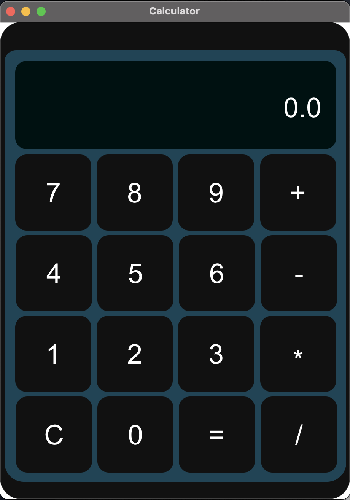

# Varun Visakamalla

## Date Time:  5:54 pm Saturday, 18 March 2023 (IST)

## Java Training acquired

> 1. JAVA SWING: Subtle understanding of Swing components and functionalities and their role in creating customized and complex applications. Worked on basic applications such as Calculator, Basic sEmployee Management System etc., the inclusion of JDBC and OOPS concepts that makes it more custom-oriented and user interactive.

> 2. JAVA FX: Basic overview and brief understanding of JAVA FX and its use cases that can be implemented for creating applications. Worked on simple applications such as Calculator,Login Forms and To-do App where we can track attendance and add new employees and explored various components involved that make the portrayal of the application rich and interactive.

> 3. JAVA: Good understanding of OOPS concepts and JDBC.Currently, at a beginner’s level, but constantly working to build and sharpen my skills that can contribute to overall growth.

## CRUD Operations with JDBC and Azure SQL Server

> 1. Topic-1
> 1. Topic-2

## Calculator Using JavaFX 

> The calculator app is designed to perform basic arithmetic operations, including the capability of performing multiple operations in a single line. It is designed to provide an easy-to-use interface for performing basic calculations. It is developed in JavaFx with fxml file as frontend.

## Installation

To use this calculator app, you can follow the steps below:

> 1. Clone the repository. You can also download the zip file and extract it to your preferred directory.

> 2. Open the project in your favorite Java IDE (e.g. Eclipse, IntelliJ IDEA, NetBeans). Ensure that you have installed the necessary dependencies required for the project to run.

> 3. Run the Main.java file. This should open the calculator app window. 

## Usage

### The calculator app is designed to perform basic arithmetic operations. To use the app, follow the steps below:

> 1. Enter a number by clicking on the buttons with the numbers on them. The number will appear on the input display at the top of the app.

> 2. Select the operation you want to perform by clicking on the corresponding button (+, -, *, /). The selected operation will also appear on the input display.

> 3. Enter the second number. The second number will also appear on the input display.

> 4. Click on the "=" button to get the result. The result will appear on the output display at the bottom of the app.

> 5. To clear the input, click on the "C" button. This will clear the input display.

## Design 

## Code Description

> 1. Create Main class which extend Application and override start method.(https://github.com/visakamallavarun/ms-mar-2023-demo/blob/main/calculator/src/main/java/com/example/calculator/HelloApplication.java)
> 2. Create a Controller class which is used to evaluate the actions performed. Create a method to evalute the 

